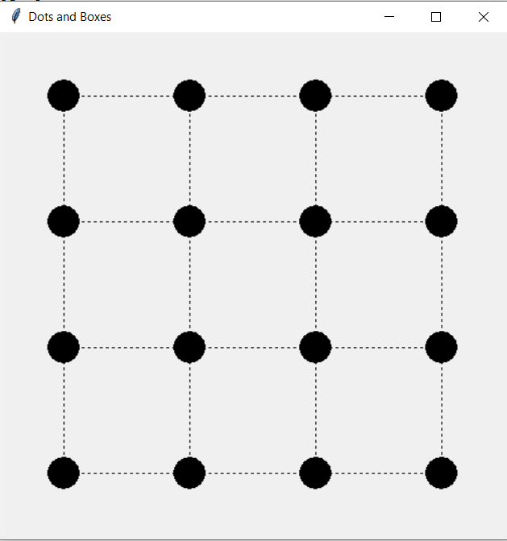

### Dots and boxes 
is a pencil-and-paper game for two players (sometimes more). 
It was first published in the 19th century by French mathematician Édouard Lucas, who called it la pipopipette. 
It has gone by many other names, including the dots and dashes, game of dots, dot to dot grid, boxes, and pigs in a pen.

The game starts with an empty grid of dots. Usually two players take turns adding a single horizontal or vertical line between two unjoined adjacent dots. A player who completes the fourth side of a 1×1 box earns one point and takes another turn. A point is typically recorded by placing a mark that identifies the player in the box, such as an initial. The game ends when no more lines can be placed. The winner is the player with the most points. The board may be of any size grid. When short on time, or to learn the game, a 2×2 board (3×3 dots) is suitable. A 5×5 board, on the other hand, is good for experts.

### Description:
This repository contains an implementation of the classic pen-and-paper game Dots and Boxes. 

### Difficulty Levels:
Easy: In this mode, the bot makes random moves.
Medium: The bot in this mode employs a basic strategy based on LocalSeach.
Hard: This is the most challenging mode, where the bot utilizes the minimax algorithm with alpha-beta pruning. It explores the game tree to find the optimal sequence of moves, aiming to minimize the player's score while maximizing its own.

# A game of dots and boxes

